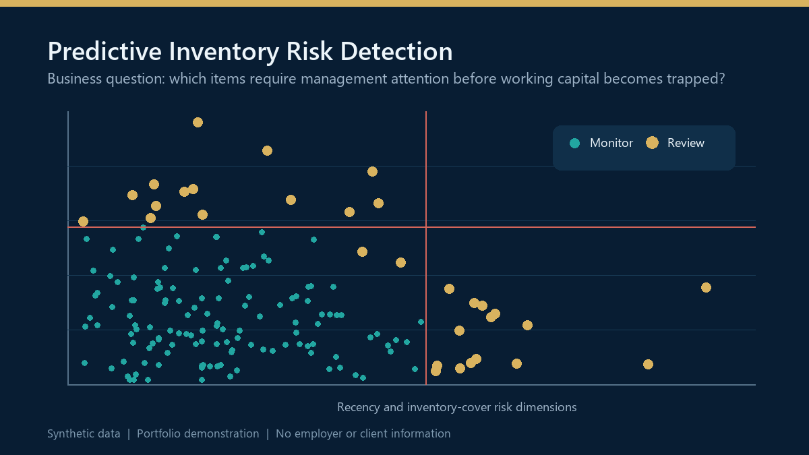

# Predictive Inventory Risk Detection

> Executive decision-support portfolio project using synthetic data.

## Business objective

Help Finance, Operations, and Supply Chain identify inventory requiring management attention before working capital becomes trapped or obsolescence risk increases. The framework prioritizes review candidates while keeping the final business decision with domain owners.

## Executive questions supported

- Which items show unusual combinations of age, sales velocity, and inventory cover?
- Where should teams focus investigation and action first?
- Which risk signals are explainable to Finance and operational stakeholders?
- How should model flags be governed before they influence reserves or purchasing decisions?

## Decision logic

The notebook engineers interpretable inventory-risk features and applies Isolation Forest to identify unusual patterns. The model is used as a prioritization tool, not an automated write-off decision. Flagged items require operational review and documented disposition.

## What the model produces

- Prioritized inventory-review candidates
- Explainable features such as recency, cover, ageing, and sales-to-stock relationship
- Visual separation of routine and unusual risk patterns
- A review workflow for Finance and Supply Chain
- Clear controls for human validation and exception handling

## Governance and privacy

This is a portfolio demonstration built entirely with synthetic data. It contains no employer, client, SKU, customer, sales, reserve, or inventory information. Model flags are illustrative and should never be treated as automatic accounting or operational decisions.

## Run the notebook

1. Install the packages in `requirements.txt`.
2. Open `inventory_obsolescence_detection.ipynb` in Jupyter or Google Colab.
3. Run the notebook from top to bottom to generate the synthetic data, model, and visual review output.

## Technology and analytical methods

Python, pandas, NumPy, scikit-learn, Isolation Forest, matplotlib, seaborn, anomaly detection, working-capital analytics, model governance.

---

Created by [Aftab Khan](https://www.linkedin.com/in/aftabparvezkhan/) as part of a finance, data, and AI decision-intelligence portfolio.
